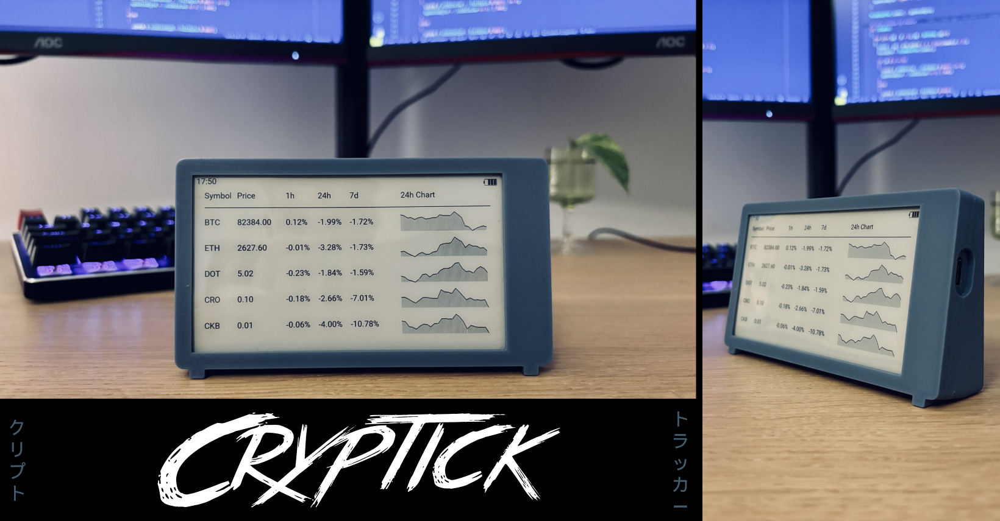
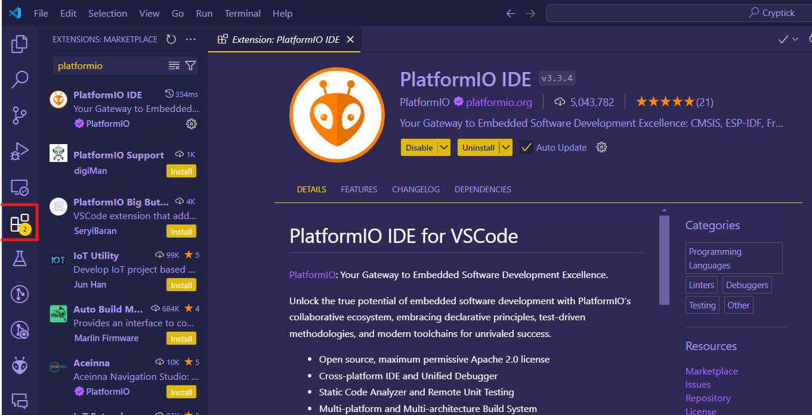
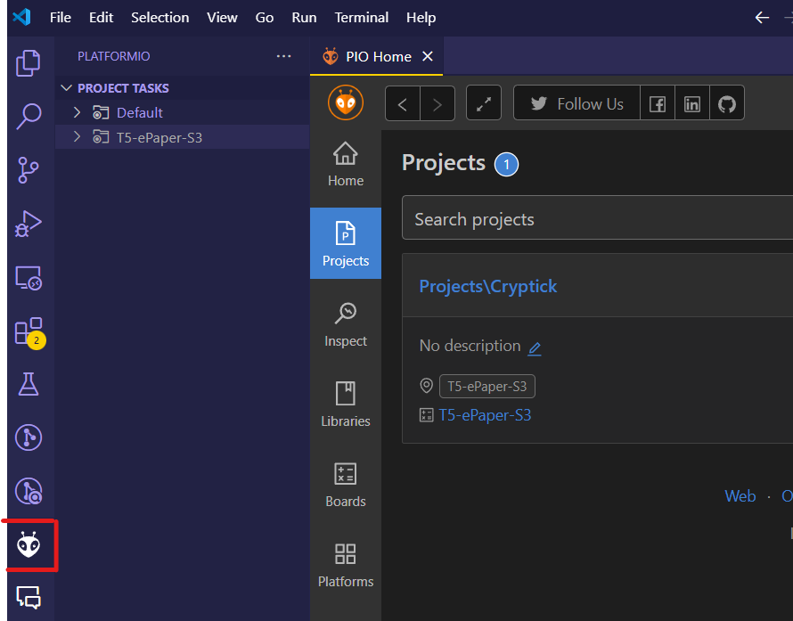
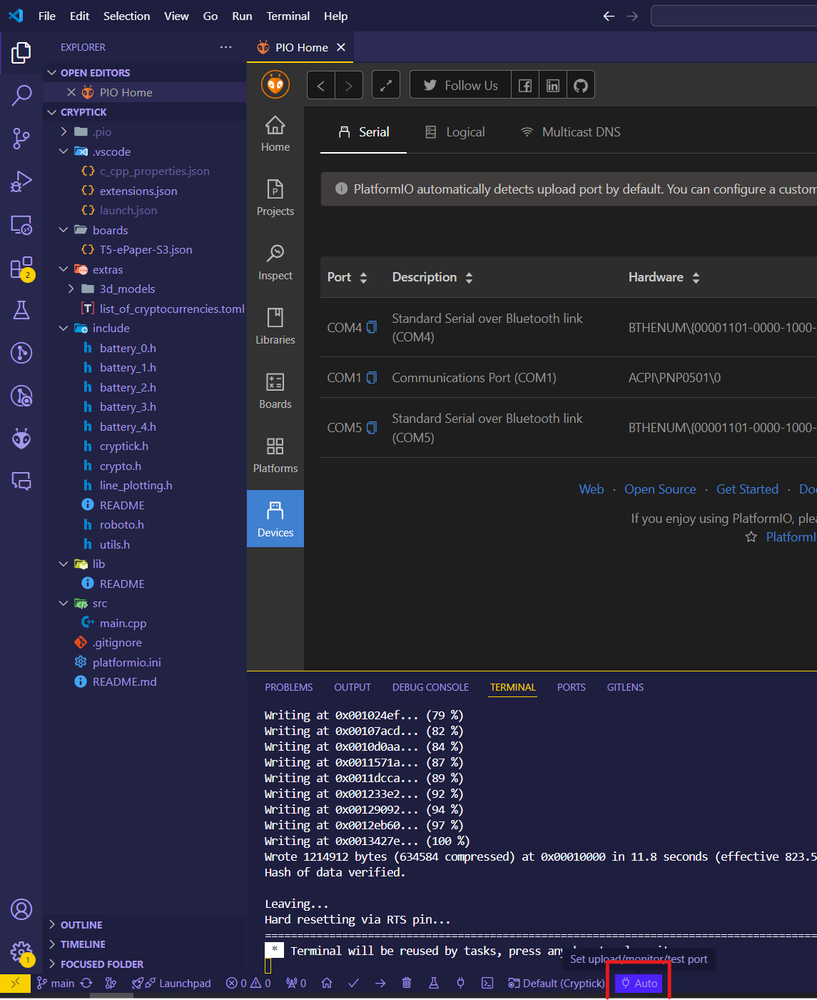
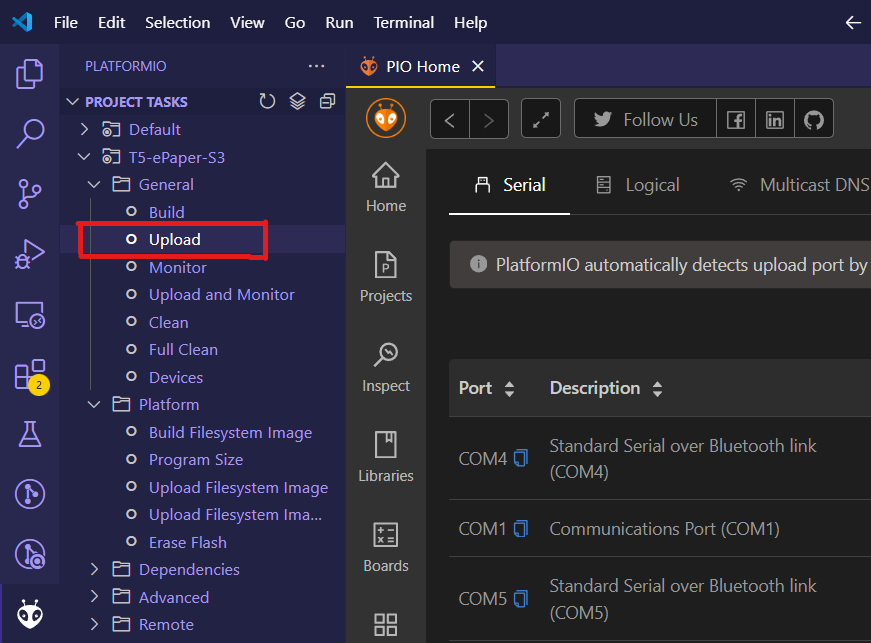

<h1 align="center">Cryptick: A Low-Power Crypto Price Tracker</h1>

Cryptick is a DIY e-paper display device designed to track cryptocurrency prices in real-time with minimal power consumption. Using a Lilygo T5 e-paper display, it fetches live price updates from Coingecko and refreshes automatically every 30 minutes.

This project is ideal for crypto enthusiasts looking for a compact, always-on dashboard without the need for a power-hungry screen. With an easy setup process and support for custom cryptocurrency selections, Cryptick ensures you stay up to date on market movements at a glance.

Key Features:

🔋 Low-power consumption – Runs for a week on a single charge\
💻 E-paper display – Always visible, even without backlight\
🔃 Auto-refresh – Updates price data every 30 minutes\
🔨 DIY-friendly – Simple to assemble and customize\
📶 Wi-Fi enabled – Fetches real-time data via Coingecko API

## Parts

| **Name**                                                                                                               | **Cost** |
| ---------------------------------------------------------------------------------------------------------------------- | -------- |
| [e-Paper Display - Lilygo T5 e-Paper](https://lilygo.cc/products/t5-4-7-inch-e-paper-v2-3?_pos=1&_sid=253bca187&_ss=r) | ~45$     |
| [Battery - 1200mAh 3.7V LiPo Battery](https://thepihut.com/products/1200mah-3-7v-lipo-battery)                         | ~15$     |
| 3D-Printed Case (if done yourself)                                                                                     | ~2$      |
|  |  |
| **Total**                                                                                                              | ~65$     |

## How to install

1. Download and install [VS Code](https://code.visualstudio.com/) 
2. Clone this project somewhere on your PC
3. In VS Code, install PlatformIO IDE:
	1. Click on the extensions icon on the left hand bar
	2. Look for "Platformio"
	3. Select "Platformio IDE"
	4. Click on Install
	
4. Open your project with Platformio
	1. Go to the Platformio Extension
	2. Go to the Projects tab
	3. Click on "Add Existing"
	4. Select the project (the folder should have a `platformio.ini` file)
	5. Let Platformio install all the dependencies (little dialog should pop up in the bottom right)
	
5. Select your device in Platformio
	1. At the bottom of the window, click on "Auto"
	2. Take note of all the ports used up
	3. Connect your device via USB
	4. Now click on the "Auto" again
	5. You should see a new communication port (starts with COM), click on it. This tells Platformio that when we upload the program, to upload it to this device.
	
6. Upload the program to your device
	1. In Platformio under the project tasks, go to the T5-ePaper-S3 board
	2. Select "Upload"
	

## How to set up your crypto dashboard

1. Get a Coingecko API key 
	1. Head over to [Coingecko](https://www.coingecko.com/en/api/pricing) and click on "Create Free Account" (or choose for a paid subscription, up to you!)
	2. Once your account is created, head over to the [Developer Dashboard](https://www.coingecko.com/en/developers/dashboard)
	3. Click on "+ Add New Key", and make note of the API Key (you will need it for later!)
2. After installing Cryptick onto your device, your device should be on the set up page, if not, press on the right-most button (make sure your device is plugged in).
3. Follow the instructions on the screen
4. On the cryptocurrency selection page, you need to insert the `id` of the coin. A list of available cryptocurrencies is available [here](extras/list_of_cryptocurrencies.toml). For example if you wanted to track Ethereum Classic, the id would be `ethereum-classic`.
5. Once, selected, click on submit, the screen will take a minute to refresh and that's it! Enjoy tracking cryptos 🎉

## General FAQ

**Q: How often does it update?**

A: Prices automatically update every 30 mins. Unfortunately, more frequent updates are not possible due to API rate limits. The last update time will be printed on the upper-left corner.

**Q: What does the button do?**

A: Pressing the main button (`REST`) will wake up the device and refresh the prices, it may take a minute to do so.

 **Q: I want to reset my device and set it up fresh again, how can I do this?**
 
 A: To factory reset the device:
- Take the device out of its case (if you have a case)
- Press the `SENS0P_VN` (3rd) button
- While you are pressing the 3rd button, press and release the `REST` (1st) button
- Keep pressing the 3rd button, after around 3 seconds, the screen should show the `Cryptick` welcome screen. You can now release the button. The device will turn off.
- If you want to start the setup screen, simply press the 1st button, instructions should show up on the screen.

**Q: What happens if internet goes down?**

A: If the board couldn't connect to internet, it will go into deep sleep mode and retry in 30 mins.

**Q: How do I charge the battery?**

A: The battery life should last for at least a week. Once depleted, you can charge it with the USB C port. A red LED should light up, this means that it's charging. The LED will light green once fully charged.

## Developer FAQ

**Q: VS Code tells me my device is not available, but I have connected it to my PC?**

A: If the device is in deep sleep mode, the port won't be connected and as such uploading the program will not work. To ensure that the device is on and ready to be flashed, follow these steps:
- Take the device out of its case (if you have a case)
- Press the `STR_I00` (2nd) button
- While you are pressing the 2nd button, press and release the `REST` (1st) button
- Release the 2nd button. Your device should now be on and in stand-by mode, ready to be flashed.
- If you want to get out of this mode, press the 1st button.

## Contributions

Contributions and ideas are most welcome! Feel free to open issues and pull-requests with any suggestions/issues you may have.

## Special Thanks

Special thanks to [techiesms](https://www.youtube.com/watch?v=g-UckNaSy0Y) from whom this project is inspired. The github project can be found [here](https://github.com/techiesms/Crypto-Currency-Display-usign-ESP32---Epaper-display).

## License

This repository follows the  [CC BY-NC 4.0](https://creativecommons.org/licenses/by-nc/4.0/) License. This means you may use and modify this code for personal use without restrictions, but you may not commercialize it.
